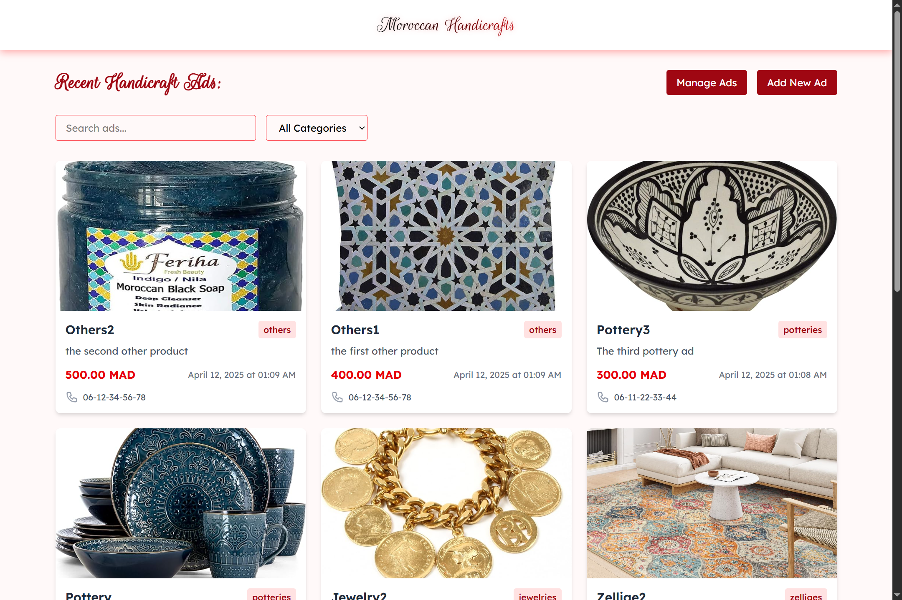
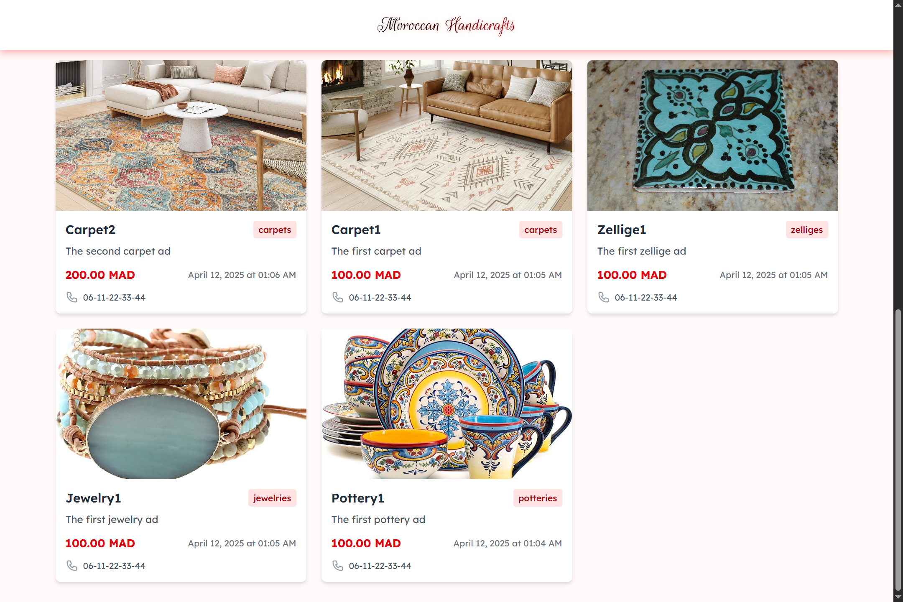
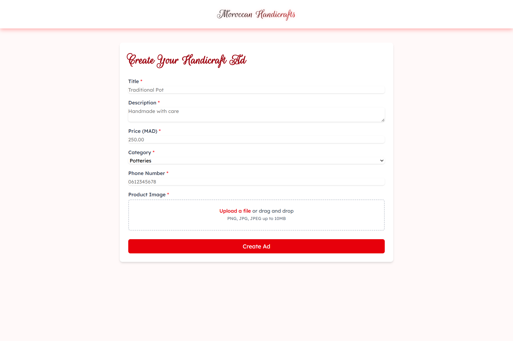
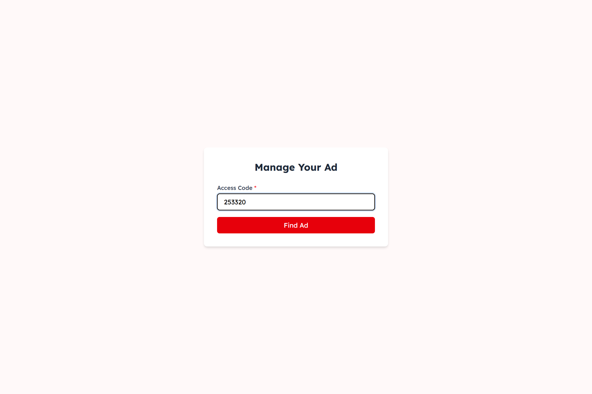
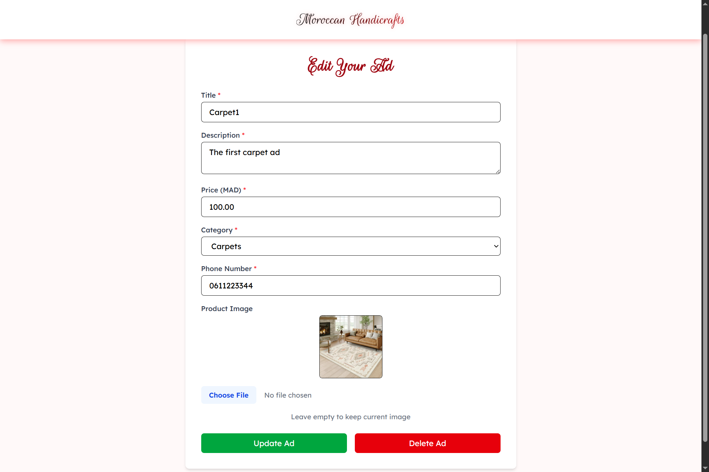
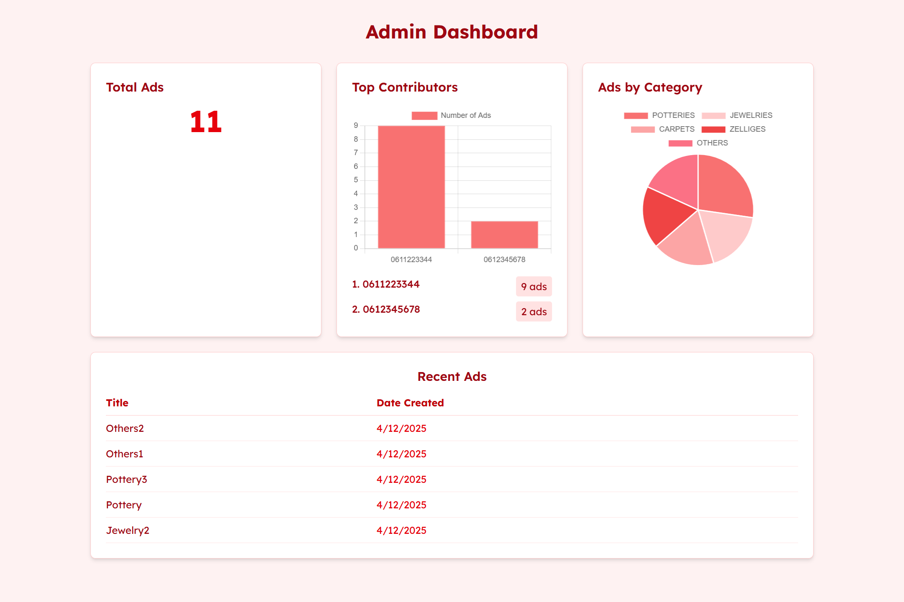

<div align="center">
  
# 🧵 Moroccan Handicrafts Marketplace

*A beautiful platform showcasing the rich tradition of Moroccan craftsmanship*

[](https://reactjs.org/)
[](https://vitejs.dev/)
[](https://tailwindcss.com/)


</div>

## ✨ About

A responsive, mobile-friendly classified ads platform dedicated to Moroccan handicrafts. Users can freely browse, post and manage beautiful artisanal products without authentication requirements.

## 📸 Screenshots

<div align="center">
  
  
  
  
  
  

</div>

## 🌟 Features

<table>
  <tr>
    <td width="50%">
      <h3>🎨 Beautiful UI</h3>
      <ul>
        <li>Rich red-themed design inspired by Moroccan aesthetics</li>
        <li>Responsive layout for all devices</li>
        <li>Smooth animations and transitions</li>
      </ul>
    </td>
    <td width="50%">
      <h3>📝 Simple Ad Creation</h3>
      <ul>
        <li>Intuitive form for creating listings</li>
        <li>Image upload functionality</li>
        <li>Category selection system</li>
      </ul>
    </td>
  </tr>
  <tr>
    <td width="50%">
      <h3>🔐 No-Login Management</h3>
      <ul>
        <li>Auto-generated 6-digit access code</li>
        <li>Edit or delete using access code</li>
        <li>Simple yet secure management system</li>
      </ul>
    </td>
    <td width="50%">
      <h3>🔍 Smart Browsing</h3>
      <ul>
        <li>Search functionality for finding specific items</li>
        <li>Category filtering system</li>
        <li>Creation date and time displayed elegantly</li>
      </ul>
    </td>
  </tr>
</table>

## 📊 Admin Dashboard

Monitor platform activity with our comprehensive admin panel featuring:

- 📈 Real-time statistics on listings and user engagement
- 🥧 Interactive pie charts showing category distribution
- 📊 Bar charts displaying posting trends over time
- 🔍 Detailed analytics for platform optimization

## 🛠️ Tech Stack

<div align="center">
<table border="0">
  <tr>
    <th align="center">Frontend</th>
    <th align="center">Styling</th>
    <th align="center">Data Visualization</th>
    <th align="center">API Communication</th>
  </tr>
  <tr>
    <td align="center">
      <br>
      React.js + Vite
    </td>
    <td align="center">
      <br>
      Tailwind CSS
    </td>
    <td align="center">
      <br>
      Chart.js
    </td>
    <td align="center">
      <br>
      Axios
    </td>
  </tr>
</table>
</div>

## 🚀 Getting Started

### Prerequisites

- Node.js (v14.0 or higher)
- npm or yarn

### Installation

```bash
# Clone the repository
git clone https://github.com/Rida-Lad/classified-ads-board-for-moroccan-handicrafts-Frontend.git

# Navigate to project directory
cd classified-ads-board-for-moroccan-handicrafts-Frontend

# Install dependencies
npm install

# Start development server
npm run dev
```

Visit `http://localhost:5173` in your browser to view the application.


## 🤝 Contributing

We welcome contributions to enhance the platform! Please follow these steps:

1. Fork the repository
2. Create your feature branch (`git checkout -b feature/amazing-feature`)
3. Commit your changes (`git commit -m 'Add some amazing feature'`)
4. Push to the branch (`git push origin feature/amazing-feature`)
5. Open a Pull Request


## 🙏 Acknowledgements

- Inspired by the rich cultural heritage of Moroccan handicrafts
- Special thanks to all contributors and the open-source community

<div align="center">
  
  ***
  
  Made with ❤️ for Moroccan artisans and craft lovers
  
</div>
